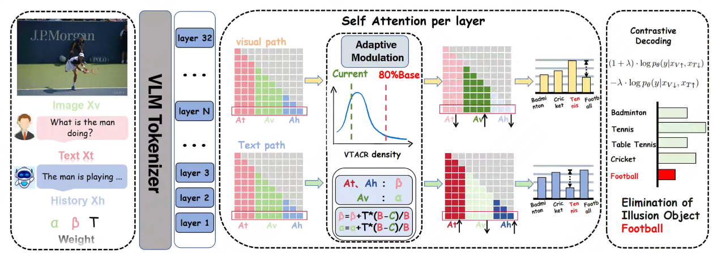

## 🎯 DPC Overview

- We introduce a dual-path contrastive decoding strategy: one path enhances visually grounded predictions, while the other amplifies hallucinations - allowing the model to "let truth shine and hallucination collapse".
- The new **contrastive probability distribution** for decoding is formulated as:

$$
P_{\text{DCD}}(Y|X_V, X_I) = \text{Softmax} \Big[ (1+\lambda) \cdot \log p_{\theta}(y|X_{V\uparrow}, X_{T\downarrow}) - \lambda \cdot \log p_{\theta}(y|X_{V\downarrow}, X_{T\uparrow}) \Big]
$$

where:
- $(X_{V\uparrow}, X_{T\downarrow})$ denotes the **visual-favored** decoding setting,
- $(X_{V\downarrow}, X_{T\uparrow})$ denotes the **text-favored** decoding setting,
- $\lambda$ is a tunable contrastive weight.
